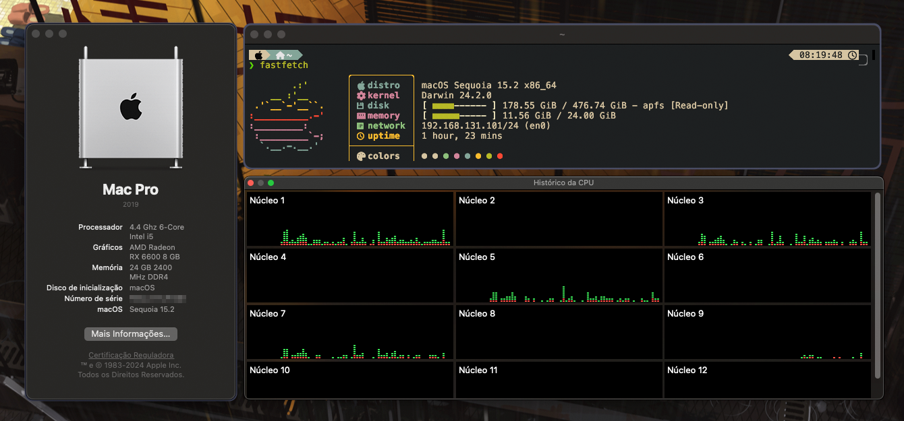

# Hackintosh - MSI PRO B760-P - Intel i5 12400F - Gigabyte RX 6600

    

## ⚠️ Disclaimer

This repository contains my fully customized EFI configuration, tailored to my specific hardware through personal experimentation. It is not a guide and should not be treated as one. Before making any changes, consult the official Dortania guide. This OpenCore setup is optimized for my exact hardware—use it only as a reference or if your hardware is identical or very similar.

## 💻 Hardware

- **Motherboard**: MSI PRO B760-P DDR4 II [[1]](https://www.msi.com/Motherboard/PRO-B760-P-DDR4-II)
- **CPU**: Intel Core i5-12400F 18M Cache, up to 4.40 GHz [[2]](https://www.intel.com/content/www/us/en/products/sku/134587/intel-core-i512400f-processor-18m-cache-up-to-4-40-ghz/specifications.html)
- **GPU**: Gigabyte Radeon™ RX 6600 EAGLE 8G [[3]](https://www.gigabyte.com/us/Graphics-Card/GV-R66EAGLE-8GD)
- **RAM**: 24GB DDR4 2400MHz
- **Storage**: 512GB NVMe SSD

## 📢 Introdution

You must [generate a new SMBIOS](https://github.com/corpnewt/GenSMBIOS) before logging into your iCloud account.

## 🛠️ Working

- [x] CPU Turbo Boost and Power Management
- [x] GPU Hardware Acceleration
- [x] Internal Audio (Realtek® ALC897 Codec)
- [x] Ethernet (Realtek® RTL8125BG 2.5G LAN)
- [x] USB Ports
- [x] Sleep and Wake
- [x] iMessage, FaceTime, App Store, iCloud

## 🚫 Not Working

- [ ] DRM (iTunes, Apple TV+, Safari, etc.)
- [ ] Bluetooth and Wi-Fi
- [ ] iPhone Mirroring

## 🧪 Not Tested Yet

- [ ] AirDrop
- [ ] AirPlay to Mac
- [ ] Apple Pay
- [ ] Auto Unlock
- [ ] Continuity Camera (Use iPhone as a webcam for Mac)
- [ ] Continuity Sketch and Continuity Markup
- [ ] Handoff
- [ ] Instant Hotspot
- [ ] iPhone Cellular Calls
- [ ] Sidecar
- [ ] Universal Clipboard
- [ ] Universal Control
